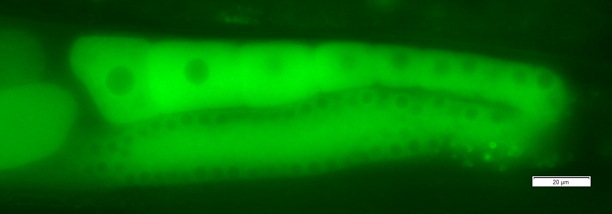

```{r setup, include=FALSE}
knitr::opts_chunk$set(echo = FALSE)
```


## Quickstart guide to R/R Markdown

What R packages are useful to know for:

* Manipulating data in R
* Plotting in R
* Interactive web-applications/plotting
* Generating documents with R - R Markdown

## My Background {.build}

```{r, fig.align="center"}

```

Orignally a worm biologist, now bioinformatician, R-Ladies Melbourne organiser

This talk can be considered 'Most Useful Things Worm Adele Would Have Liked to Have Known When Starting Out in R'

## R 


```{r out.width="50%", out.width="50%"}
knitr::include_graphics("")
```

## R

Programming language for statistical computing and graphics

Why should you care about it?

Has lots of plotting functionality and well geared towards data analysis out of box with in-built statistical tests and classes (data-frames & matrices)

[Well developed ecosystem](https://www.rstudio.com/products/rpackages/) of software packages that further expands base R for analysis, project management, visualisation, document generation, etc

Free legally & continous active development

Thorough documentation

## Data Analysis Toolbox

* Tidyverse - `an opinionated collection of R packages designed for data science`: ggplot2, dplyr, magrittr, tidyr, readr
  - ggplot2 - extensive plotting package
* Rmarkdown - document generation
* Shiny - build interactive web applications/dashboards

## Tidyverse

* 'Modern' way of writing R and geared at data science
* Fixes up some quicky behaviour from base R
* Improved data-frames - tibbles

Tidy data:

1. Each variable is in a column.
2. Each observation is a row.
3. Each value is a cell.

## dplyr

* is a grammar of data manipulation, providing a consistent set of verbs that help you solve the most common data manipulation challenges
* each verb takes a data frame as input and returns a modified version of it
* the idea is that complex operations can be performed by stringing together a series of simpler operations in a pipeline.

```
input       +--------+        +--------+        +--------+      result
data   %>%  |  verb  |  %>%   |  verb  |  %>%   |  verb  |  ->  data
frame       +--------+        +--------+        +--------+      frame
```

`%>%` - pipe symbol that passes output from one function to another (Magrittr)

## Dplyr {.smaller}

```{r, include=FALSE}
library(tidyverse)
df <- readr::read_csv("data/domestic_airline_performance.csv", quote = "")
```

```{r, echo=T}
df[1:100,]
```

## Dplyr {.smaller}

```{r, echo=T}
df %>% 
  filter(Airline != "All Airlines", Route != "All Ports-All Ports") %>% 
  group_by(Route, Airline) %>% summarise(n = n()) %>% head(20)
```

## ggplot2

`Implements the grammar of graphics, a coherent system for describing and building graphs`

Takes a data-frame input, describes which columns maps to which aethestics and then builds a plot by layering 'geoms'.

```
ggplot(df, aes(x = column_A_df, y = column_B_df, color = column_C_df, 
  shape = column_D_df, etc...)) +
  geom_point() + geom_boxplot() + geom_etc() +
  geom_line(new_data, aes(color = "blue")) + 
  theme( modifications_to_plot_appearance )
```

The top level aethestics & data will be passed on to all geoms but can be overriden by specificing new data/aethestics to that specific geom


## ggplot2 {.smaller}

```{r, echo =T}
df2 <- df %>%
  group_by(Airline, Year, Departing_Port) %>%
  summarise(n = n()) %>%
  ungroup %>%
  filter(Airline == "Jetstar" | Airline == "Qantas")
df2
```

## ggplot2 {.smaller}

```{r, echo=T}
gp <- ggplot(df2, aes(Departing_Port, n, color = Airline)) +
  geom_point() + theme(axis.text.x=element_text(angle=45, hjust=1))
gp
```

## ggplot2 {.smaller}

```{r, echo=T}
gp + geom_hline(yintercept = 50, color = "blue")
```

## Interactivity

* Plotly
* Shiny

Plotly - can create plots directly with `plot_ly()` function

Or use it as a wrapper to a `ggplot` object with `ggplotly`

## 

```{r, echo=T}
plotly::ggplotly(gp)
```

## Shiny

Develop web applications/dashboards through the use of pre-built widgets. 

Two parts to a shiny app:

* UI object - defines the appearance of the app
* Server object - contains the data processing code of the app


## R Markdown

The marriage between Markdown, a lightweight markup language and R, a programming language for statistics

An R Markdown file is a plain text document that allows you to embed R code chunks + plain text notes & images. 


## 

1. YAML header - The meta-data that describes the final document output
2. Markdown section - content/body of the document
3. Code chunks - where the R* code goes

* - actually supports up to 52 language engines including Python, Julia, C++, MySQL, bash, etc

## YAML header

Identation is important

```
---
title: "Rmarkdown Quickstart"
author: "Adele Barugahare"
date: "27/08/2019"
output: 
  ioslides_presentation:
    df_print: "paged"
  html_document:
    df_print: "paged"
    toc: true
    toc_depth: 2
    highlight: tango
---
```

## Code chunks

` ```{r, customise_output_with_code_chunk_options} `

`#Code analysis goes here`

`x <- 1:10`

`y <- x * 2`

`etc`

` ``` `

## Supported Documents 

* webpages
* R-notebooks
* PDFs
* Slideshows
* Books
* Websites

...and more created by the R community

## R Markdown & Analysis Reproducibility

Document what you've done with your data in code

R Markdown can render multiple different document types from one Rmd file

The more places (files) an analysis is spread across, the more work it is to keep all of it accurate and up-to-date.

R Markdown allows you to focus on generating content & doing your analysis without (hopefully) spending too much time fighting your document itself

## Example

* [Emi Tanaka's personal website](https://emitanaka.org/) - blogdown for website, xaringan for slides, shiny + plotly for web apps
* [Rob Hyn](https://robjhyndman.com/) - blogdown for website

## Recommended Resources

* [R for Data Science](https://r4ds.had.co.nz/)
* [R Markdown: The Definite Guide](https://bookdown.org/yihui/rmarkdown//)
* [Package cheatsheets](https://www.rstudio.com/resources/cheatsheets/)


