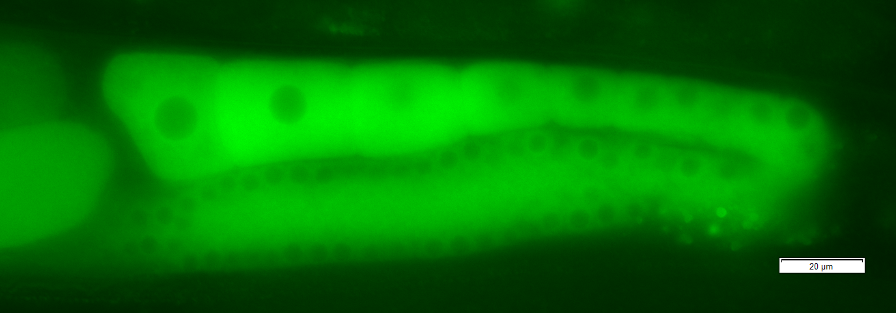

```{r setup, include=FALSE}
knitr::opts_chunk$set(echo = FALSE)
```

## In This Talk

```{r, talk_focus}

```

Will walk you through these steps with a dataset

Find these slides @ https://bit.ly/2lyGAqr

## My Background

```{r, fig.align="center"}

```

Orignally a worm biologist, now bioinformatician @ Monash Bioinformatics Platform, more recently R-Ladies Melbourne organiser

This talk can be considered 'Most Useful Things Worm Adele Would Have Liked to Have Known When Starting Out in R'


```{r, fig.align="center"}
knitr::include_graphics("https://upload.wikimedia.org/wikipedia/commons/thumb/1/1b/R_logo.svg/500px-R_logo.svg.png")
```

## R & Things I Like About It

Programming language for statistical computing and graphics

Has lots of plotting functionality and well geared towards data analysis out of box with in-built statistical tests

[Well developed ecosystem](https://www.rstudio.com/products/rpackages/) of software packages that further expands base R for analysis, project management, visualisation, document generation, etc

Continous active development

Thorough documentation

```{r}

```

## R Markdown

The marriage between Markdown, a lightweight markup language and R, a programming language for statistics

An R Markdown file is a plain text document that allows you to embed R code chunks + plain text notes & images & videos. 

Structure:

1. YAML header - The meta-data that describes the final document output
2. Markdown section - content/body of the document - your text/notes, images, links, etc
3. Code chunks - where the R* code goes

An R Markdown file by itself is quite simple but is neatly rendered into a more complicated document type

*actually supports up to 52 language engines including Python, Julia, C++, MySQL, bash, etc

## R Markdown & Analysis Reproducibility

Document what you've done with your data in code

R Markdown can render multiple different document types from one Rmd file

The more places (files) an analysis is spread across, the more work it is to keep all of it accurate and up-to-date.

R Markdown allows you to focus on generating content & doing your analysis without (hopefully) spending too much time fighting your document itself*

*the more a document is geared towards a particular output type, the harder it is to neatly convert between formats


#### YAML header

```

title: "Rmarkdown Quickstart"
author: "Adele Barugahare"
date: "27/08/2019"
output: 
  ioslides_presentation:
    df_print: "paged"
  html_document:
    df_print: "paged"
    toc: true
    toc_depth: 2
  pdf_document:
    number_sections: true
    df_print: "kable"

```

#### Code chunks

```
` ```{r, chunk_options}` `

#Code analysis goes here
x <- 1:10
y <- x * 2

plot(x, y)
etc

` ``` `
```

[R Markdown Let's Play](https://rstudio.cloud/project/481772)

Create an account at [R Studio Cloud](https://rstudio.cloud/)

Link to my github: https://bit.ly/2lyGAqr

OR 

Github account name: aabarug

Repo: quickstart_rmarkdown_sept_2019

The repo readme has a link to this workspace - you should be able to copy that into a workspace of your own

## R Data Analysis Toolbox

* Tidyverse - `an opinionated collection of R packages designed for data science`: ggplot2, dplyr, magrittr, tidyr, readr, etc
  - ggplot2 - extensive plotting package
* Shiny - build interactive web applications/dashboards
* R Markdown - document generation

Tabular data is represented as data-frames - in-built class

```{r, toolbox_image, out.width="50%", out.height="40%", fig.align='center'}

```


### Tidyverse

* 'Modern' way of writing R and geared at data science
* Fixes up some quicky behaviour from base R
* Improved data-frames - tibbles

Tidy data:

1. Each variable is in a column.
2. Each observation is a row.
3. Each value is a cell.

```{r, tidy_dat_image, out.height="90%" }

```

### dplyr

* is a grammar of data manipulation, providing a consistent set of verbs that help you solve the most common data manipulation challenges
* each verb takes a data frame as input and returns a modified version of it
* the idea is that complex operations can be performed by stringing together a series of simpler operations in a pipeline.

```
input       +--------+        +--------+        +--------+      result
data   %>%  |  verb  |  %>%   |  verb  |  %>%   |  verb  |  ->  data
frame       +--------+        +--------+        +--------+      frame
```

`%>%` - Pipe symbol that passes output from one function to another (Magrittr package)

```{r, waterfall_gif, out.height="90%", fig.align='center'}
knitr::include_graphics("images/waterfall.gif")
```

**`Dataset`** > Manipulate to extract information > Plot > Communicate

Read in data:

```{r, include=TRUE, echo=T}
library(tidyverse)
df <- readr::read_csv("data/domestic_airline_performance.csv")
```

The dataset:

Australian domestic airlines on time dataset with information from 2004 to 2019 - `r nrow(df)` rows and `r ncol(df)` columns from http://data.gov.au/

```{r, echo=T}
head(df, 50)
```

Dataset > **`Manipulate to extract information`** > Plot > Communicate

Extract route 'Adelaide-Brisbane' in the year 2008 & fix up the month column

```{r, echo =T}
df2 <- df %>%
  filter(Airline != "All Airlines", Route == "Adelaide-Brisbane", Year == 2008) %>% 
  mutate(Month = lubridate::month(x = Month_Num, label = T)) %>% head(30)
```

Dataset > Manipulate to extract information > **`Plot`** > Communicate

### ggplot2

Implements the grammar of graphics, a coherent system for describing and building graphs

Takes a data-frame input, describes which columns maps to which aethestics and then builds a plot by layering 'geoms'.

```{r, eval=FALSE, echo=T}
ggplot(df, aes(x = column_A_df, y = column_B_df, color = column_C_df, 
  etc...)) +
  geom_point() + geom_boxplot() + geom_etc() +
  geom_line(new_data, aes(color = "blue")) + 
  theme( modifications_to_plot_appearance )
```

Geoms define the type of plot the data should be displayed as.

The top level aethestics & data will be passed on to all geoms but can be overriden by specificing new data/aethestics to that specific geom

ggplot2 predates Magrittr hences it uses `+` instead of `%>%`

No geom layer - data is not displayed but a plot is generated

```{r ggplot2_base, echo=T, eval=TRUE}
gp <- ggplot(df2, aes(x = Month, y = Arrivals_On_Time, 
                      group = Airline, color = Airline))
gp
```


```{r ggplot2_line1, echo=T, eval=TRUE}
gp <- gp + geom_line()
gp
```

You can keep adding geoms...

```{r, ggplot2_line2, echo=T, eval=TRUE}
gp <- gp + geom_point(aes(y = Departures_Delayed, shape = Airline))
gp
```

```{r, ggplot2_line3, echo=T, eval=T}
gp <- gp + geom_point(aes(y = Sectors_Flown), data = 
          filter(df2, Airline == "Qantas", Route == "Adelaide-Brisbane", 
          Year == 2008), color = "black")
gp
```

```{r, ggplot2_line4, echo=T, eval=FALSE}
gp <- gp + theme_bw() + xlab("") +
  ylab("Number of arrivals on time") + 
  ggtitle("Arrivals on time on Adelaide-Brisbane route in the year 2008 per airline")
gp
```

## Packages For Interactivity

### Plotly

```{r, plotly_demo, echo = T}
df2 %>% group_by(Airline) %>% plotly::plot_ly(x = ~Month, 
    y = ~Arrivals_On_Time, color=~Airline, type = 'scatter', 
    mode = 'lines')
```


Or use it as a wrapper to a `ggplot` object with `ggplotly`

```{r, gp_eval, echo=FALSE, eval=FALSE}
gp <- ggplot(df2, aes(x = Month, y = Arrivals_On_Time, group = Airline, color = Airline)) + 
  geom_line() + geom_point(aes(y = Departures_Delayed, shape = Airline)) + 
  geom_point(aes(y = Sectors_Flown), data = filter(df2, Airline == "Qantas", Route == "Adelaide-Brisbane", Year == 2008), color = "black") + theme_bw() + ylab("Number of arrivals on time") + xlab("") 
```


```{r, ggplotly_code_block, echo=TRUE, eval=TRUE}
plotly::ggplotly(gp)
```

Dataset > Manipulate to extract information > Plot > **`Communicate`**


### Shiny

Develop interactive web applications/dashboards through the use of pre-built widgets. 

Two parts to a shiny app:

```{r, echo=T, eval=FALSE}
ui <- fluidPage(
  ## Define the user interface here 
  ## Layout of input and output widgets
)
server <- function(input, output) {
  #Server code to process inputs from ui, manipulate data accordingly
  # Then send back to UI to display an output
}

# Run the app
shinyApp(ui = ui, server = server)
```

#### A simple Shiny app in about 9 lines of code

```{r, shiny_example, echo=T, eval=TRUE}
library(shiny)

# Define UI for app that draws a line plot -
ui <- fluidPage(
    # Input: widget to select which airline to plot 
    selectInput(inputId = "select_airline", label = h3("Select airlines"), 
                choices = list("Jetstar", "Qantas", "Virgin Australia"), 
                selected = "Jetstar"),
    
    # Output: Line plot -
    plotOutput(outputId = "linePlot")
)
```

#### A simple Shiny app in about 9 lines of code

```{r, server_shiny, echo=T, eval=TRUE}
# Define server logic required to draw a line plot -
server <- function(input, output) {
  output$linePlot <- renderPlot({
    # Read data in and filter based on which airline is selected from the widget
    df <- df2 %>% 
      filter(Airline == input$select_airline)
    # Generate ggplot
    ggplot(df, aes(x = Month, y = Arrivals_On_Time, 
                      group = Airline)) + geom_line()

    })
}

# Run the application 
shinyApp(ui = ui, server = server)
```

[Link to simple app](https://bioinformatics3.erc.monash.edu/rsconnect/connect/#/apps/57/access)

More examples:
* [Varistran demo app](http://rnasystems.erc.monash.edu:3838/pfh/2015/demo-varistran/)
* [Shiny Gallery](https://shiny.rstudio.com/gallery/)

## R Markdown Outputs

Supported Documents Outputs

* webpages
* R-notebooks
* PDFs
* Slideshows
* Books
* Websites

...and more created by the R community

Packages that further build on top of R Markdown

* [blogdown](https://bookdown.org/yihui/blogdown/) - combines R Markdown & Hugo to create general purpose websites
* [bookdown](https://bookdown.org/) - authoring books, thesis, sfotware manuals, etc
* [flexdashboards](https://rmarkdown.rstudio.com/flexdashboard/) - HTML outputs with dashboard layouts
* [xaringan](https://slides.yihui.name/xaringan/) - slides shows with remark.js

## Neat Examples

* [Emi Tanaka's personal website](https://emitanaka.org/) - blogdown for website, xaringan for slides, shiny + plotly for web apps
* [Rob Hyndman](https://robjhyndman.com/)

## Recommended Resources For Further Learning

* [R for Data Science](https://r4ds.had.co.nz/)
* [R Markdown: The Definite Guide](https://bookdown.org/yihui/rmarkdown//)
* [Package cheatsheets](https://www.rstudio.com/resources/cheatsheets/)
* [R Intro Course developed by Monash Bioinformatics Platform](https://monashdatafluency.github.io/r-intro-2/)
* [Advanced R course developed by MBP](https://monashbioinformaticsplatform.github.io/r-more/)
* [Reproducible Research in R developed by MBP](https://monashdatafluency.github.io/r-rep-res/)
* [Markdown syntax guide](https://daringfireball.net/projects/markdown/syntax)
* [R Markdown workshop slides by Ulrik Lyngs](https://ulyngs.github.io/rmarkdown-workshop-2019/slides/Day1.html#1)